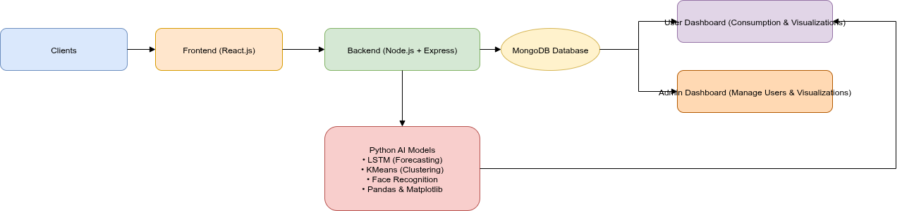
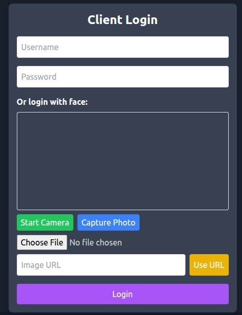
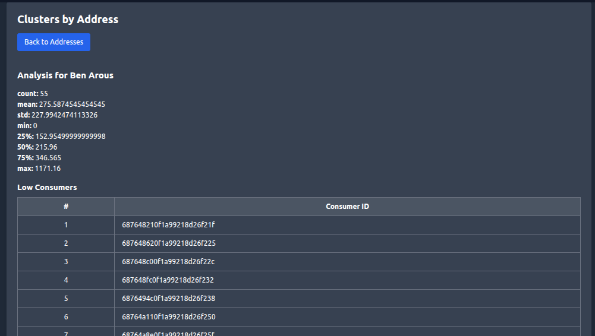
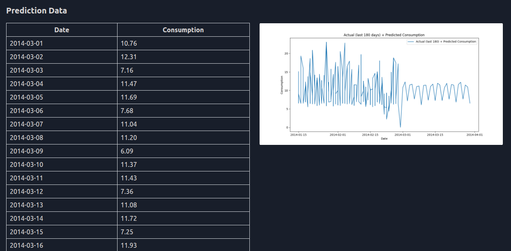
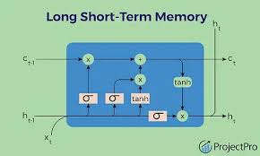

# Carthage Smart – Energy Consumption Monitoring & Optimization

## Project Overview

Carthage Smart is a web application designed to help users monitor and optimize household energy consumption.  
It combines MERN Stack (MongoDB, Express, React, Node.js) with Python AI models for forecasting and clustering, and includes face recognition for secure login.

---

## Architecture

**Flow:**

1. Users/Admins log in via Web App (React).
2. Frontend communicates with Node.js backend via `fetch`.
3. Backend interacts with Python AI models and MongoDB database.
4. Results are returned to **User Dashboard** or **Admin Dashboard**.

---

## Technologies Used

- **Frontend:** React.js
- **Backend:** Node.js + Express
- **AI / Data:** Python (LSTM, KMeans, Pandas, Matplotlib, Face Recognition)
- **Database:** MongoDB
- **Visualization:** Python Matplotlib

---

## Installation

1. Clone the repository:
   git clone https://github.com/essioui/Carthage-Smart.git

2. Install backend:

- cd backend
- npm install express mongoose
- node server.js

3. Install frontend:

- npx create-react-app frontend
- cd frontend
- npm start

## Future Improvements

- Integrate a Chatbot to explain predictions and provide energy-saving advice.

- Add more AI models for advanced forecasting.

- Improve the UI for a better user experience.

## Screenshots

### Login Page

### Admins Dashboard - Predicted Data

### Clients Dashboard

### LSTM Model Flow

## More Details

- [Frontend README](frontend/README.md)
- [Backend README](backend/README.md)

## Author

**Salah Essioui** – 
